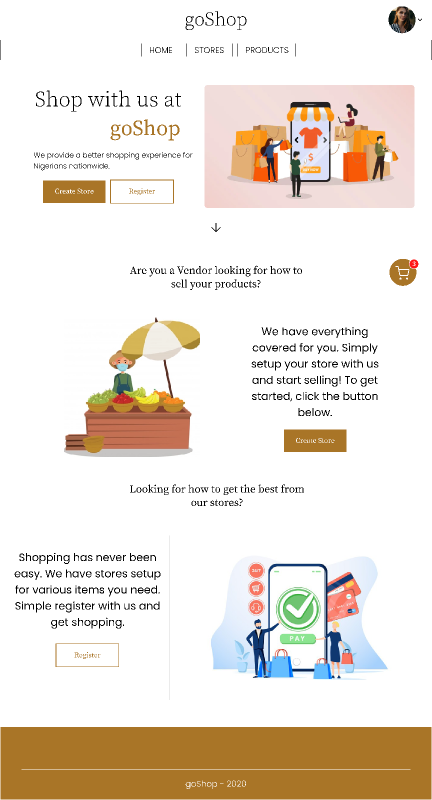
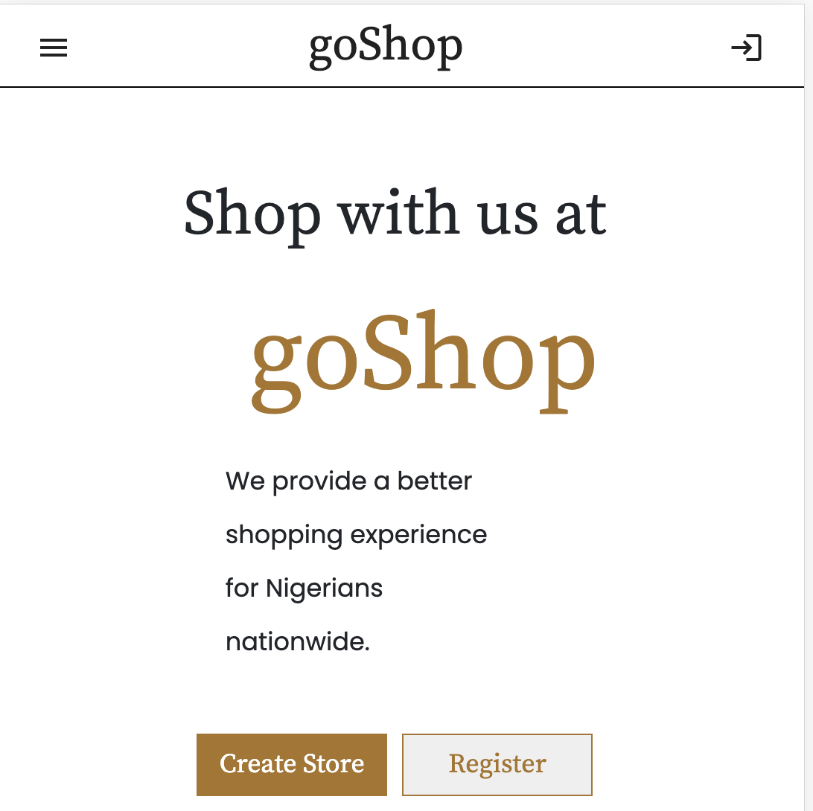

# GoShop

**goShop** is an online e-commerce market which is to host various vendors and buyers of different goods and services.  Vendors can market there products and subscribed buyers can shop at a large discount rate unlike unsubscribed buyers.  **goShop** will ensure its vendors sell goods at industrial rate and any form of perishable goods will be cross checked to ensure it is fresh and affordable to the community.  **goShop** will enable vendors to monitor there goods, avoid theft, easy to track there income and products and also give them an online presence to reach more buyers at different locations.  **goShop** will partner with logistics service providers to ensure smooth and easy delivery of goods and also ensure secure and payment options to its users.

The idea behind **goShop** is to:
* help reduce over population of people on the streets
* curb traffic in cities like Lagos and others facing traffic situations
* making shopping convenient for buyers
* help buyers in price comparison
* making it easy to avoid crowds

## Technology stack and tools

1. The Angular Cli framework will be adopted for the frontend
1. Python language will be used for the back end adopting Django framework using NoSQL web services and MongoDB as the non relational database
1. Java will be the programming language used to develop the Android App version of the project.
1. Github will be used as the version control to be used for the team project collaboration.

## Demo video

